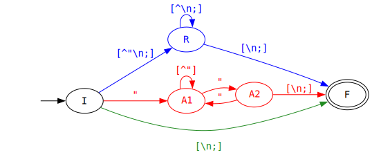

# PL 2024/25 - TPC 2

## Problema proposto

Procura-se um programa Python que leia um [_dataset_](dataset.csv) e crie as seguintes estruturas de
dados:

 1. Lista ordenada alfabeticamente dos compositores musicais;
 2. Distribuição das obras por período: quantas obras catalogadas em cada período;
 3. Dicionário em que a cada período está a associada uma lista alfabética dos títulos das obras
    desse período.

Não é permitido o uso do módulo Python [`csv`](https://docs.python.org/3/library/csv.html).

## Metodologia

Para criar um programa que cumpre os requisitos colocados, utilizou-se a _pipeline_ clássica de
processamento de linguagens:

 - Um analisador léxico extrai os lexemas (valores do CSV);
 - Um analisado sintático constrói uma estrutura de sintaxe abstrata (dicionário que associa IDs de
   peças musicais a _records_ com os seus dados);
 - Um analisador semântico, no caso, associado à execução das interrogações ao _dataset_;

### Analisador léxico

Para identificar lexemas CSV, foi construído o seguinte autómato, cuja representação DOT pode ser
encontrada [aqui](Automaton.dot):



Como se pode observar, a partir do estado inicial, há três tipos de lexema CSV que podem ser
encontrados:

 1. Quando um separador (`\n` ou `;`) é encontrado de imediato, tem-se um lexema vazio, e
    transita-se para o estado final;
 2. Quando são encontradas aspas (`"`) no início da _string_, pode seguir-se uma _string_ que é uma
    sequência de caracteres quaisquer, com a exceção de aspas, que têm de surgir em sequências de
    duas (é assim que se escapam aspas em CSV). Quando uma única aspa é encontrada seguida de um
    separador, o lexema é dado como terminado;
 3. Quanto o primeiro carácter não é nem um separador nem aspas, o lexema é constituído por uma
    sequência de carácteres que não separadores até o primeiro separador ser encontrado;

Com base neste autómato, pode construir-se uma expressão regular para identificar lexemas CSV.
Abaixo, apresenta-se a expressão regular colorida, para mostrar como esta foi derivada a partir das
diferentes partes do autómato:

<pre>
(?:<span style="color: forestgreen;">()</span>|<span style="color: blue;">([^"\n;][^\n;]*)</span>|<span style="color: red;">(?:"((?:[^"]|"")*)")</span>)[\n;]
</pre>

Como se pode observar, visto que todos os lexemas terminam num separador, este foi apenas mencionado
uma vez no final da expressão regular, e não em todos os casos disjuntos. Ademais, alguns dos grupos
de captura surgem com o prefixo `?:`, significando que não devem ser apresentados no _output_ das
_matches_, servindo apenas para agrupar sequências para controlar a ordem de aplicação dos
operadores RegEx (como se faz em expressões algébricas, por exemplo). Os grupos de captura sem este
prefixo são os que correspondem aos conteúdos dos lexemas CSV.

Para identificar lexemas RegEx numa _string_, a expressão regular acima é utilizada na função Python
`re.findall`. No entanto, devido à existência de vários grupos de captura, cada _match_ contém
várias _strings_. Por exemplo, considere-se o seguinte input:

```csv
;"""Cem Anos de Solidão"" é o meu livro preferido";Humberto Gomes
```

O _output_ de `findall` para esta _string_ é:

```python
[
    ('', '', ''),
    ('', '', '""Cem Anos de Solidão"" é o meu livro preferido'),
    ('', 'Humberto Gomes', '')
]
```

Algum tratamento desta estrutura é necessário antes da sua devolução: a escolha do grupo de captura
correto em cada caso e a substituição das ocorrências de `""` por `"`.

### Analisador sintático

O analisador sintático consome lexemas 7 a 7, o número de campos de dados numa composição musical.
Estes valores são utilizados para construir um _record_ com os dados da composição. Algum tratamento
é aplicado a algum dos campos: o ano de composição de uma peça é convertido para um inteiro, e a
duração de cada peça é devida em três partes (`XX:YY::ZZ`), cada uma também interpretada como um
inteiro. Estes _records_ são colocados num dicionário que associa o ID de cada peça ao seu _record_.
O analisador sintático também é responsável por descartar os 7 primeiros lexemas, correspondentes ao
cabeçalho do ficheiro.

### Analisador semântico

Nesta _pipeline_, a análise semântica corresponde à execução das interrogações, simples algoritmos
Python sem relevância para a UC de Processamento de Linguagens.

## Resultados

O programa desenvolvido foi testado lê os conteúdos do ficheiro `dataset.csv`, procede à sua análise
sintática e semântica, e termina com a execução das interrogações pedidas pelo enunciado. Com o
_dataset_ presente neste repositório, verifica-se que o comportamento do programa corresponde ao
esperado. O programa pode ser executado do seguinte modo

<pre>
$ python3 <a href="TPC.py">TPC.py</a>
</pre>

## Autoria

 - **Nome:** Humberto Gil Azevedo Sampaio Gomes
 - **Número mecanográfico:** A104348
 - **Data:** 2025/02/16


